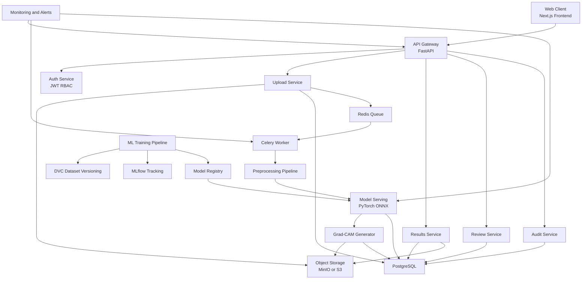

# MedVision-CXR 项目总设计文档

## 一、项目概述

### 1. 项目名称

| 项目项 | 内容 |
|---|---|
| 中文名 | MedVision-CXR：面向基层医疗的可解释胸部 X 光辅助分诊系统 |
| 英文名 | MedVision-CXR: Explainable Chest X-ray Triage for Primary Healthcare |
| 中文一句话简介 | 一个面向基层场景的胸部 X 光 AI 辅助分诊平台，通过多标签风险提示、风险分层与可解释热力图帮助医护人员优先复核高风险胸片。 |
| 英文一句话简介 | An explainable chest X-ray triage platform for primary healthcare that provides multi-label risk prompts, triage prioritization, and visual explanations to help clinicians review high-risk cases first. |

### 2. 项目背景

基层医院、社区诊所和低资源地区通常面临影像科医生不足、胸片阅读压力大、病例优先级判断不稳定的问题。胸部 X 光是最常见、最基础、最具普及性的影像检查之一，因此特别适合做 AI for Good 场景下的辅助筛查和辅助分诊。

### 3. 真实痛点

| 痛点 | 说明 |
|---|---|
| 医生资源不足 | 基层机构可能没有专职影像科医生，胸片需由全科或轮转医生初筛。 |
| 复核优先级不稳定 | 高风险胸片可能淹没在大量普通病例中，延误人工复核。 |
| 低资源地区信息化不足 | 需要轻量、可部署、可离线或弱网运行的系统。 |
| 模型黑盒问题 | 医护人员对纯分数输出信任有限，需要解释和不确定性提示。 |
| 医疗伦理压力 | 需要明确 AI 不替代医生，且必须支持审计、删除和合规留痕。 |

### 4. 目标用户

| 用户 | 需求 |
|---|---|
| 基层医生 | 快速识别需要优先复核的胸片 |
| 影像科医生 | 查看 AI 辅助分析结果和热力图，提升复核效率 |
| 公共卫生筛查团队 | 在移动筛查车、社区筛查点进行快速分诊 |
| 医院管理者 | 通过审计日志和模型版本记录管理风险 |
| 研究与竞赛评委 | 评估项目社会价值、可解释性、Responsible AI 完整性 |

### 5. 典型使用场景

| 场景 | 说明 |
|---|---|
| 社区诊所初筛 | 上传胸片后获得风险提示和复核建议 |
| 基层医院急诊分流 | 高风险或不确定病例优先进入医生复核队列 |
| 移动筛查车 | 在网络不稳定环境下使用离线或边缘部署版本 |
| 公共卫生项目 | 用于大规模胸片辅助筛查和人工复核排序 |

### 6. 为什么适合 AI for Good

1. 解决医疗资源不均衡问题。
2. 提升基层场景下的分诊效率，而非追求替代医生。
3. 强调可解释性、公平性、隐私保护和人机协同。
4. 可扩展到低资源地区、公益筛查和移动医疗场景。

### 7. 对应联合国可持续发展目标

| SDG | 对应关系 |
|---|---|
| SDG 3 健康与福祉 | 提升基础医疗服务可及性，帮助更快识别需要优先复核的胸片 |
| SDG 9 产业、创新和基础设施 | 以数字医疗平台改善基层医疗基础设施 |
| SDG 10 减少不平等 | 缩小城市与基层、富裕地区与低资源地区医疗差距 |
| SDG 17 促进目标实现的伙伴关系 | 可与医院、高校、公益组织和公共卫生部门协作 |

### 8. 社会影响力

本项目预计可以在不增加大量人力的情况下提升基层胸片复核优先级排序效率，帮助医护人员把有限精力聚焦在高风险与高不确定性病例上，减少漏看风险，增强医疗可及性，并为 Responsible AI 医疗应用提供可复用模板。

## 二、产品功能设计

| 功能 | 设计说明 | 安全边界 |
|---|---|---|
| 胸片上传 | 支持 PNG、JPG、JPEG、DICOM 上传 | 上传前必须展示知情同意与免责声明 |
| 图像格式校验 | 校验 MIME、扩展名、像素尺寸、灰度通道、DICOM 基本字段 | 拒绝异常格式和潜在恶意文件 |
| 胸片质量检查 | 检查过曝、欠曝、模糊、裁切、方向异常、非胸片风险 | 低质量图像不阻断上传，但标记质量风险 |
| AI 辅助分析 | 调用多标签模型输出 ai_assisted_findings 和 triage_result | 仅输出风险提示，不输出确定性诊断 |
| 多标签异常风险提示 | 对 12 个标签输出概率、阈值状态和解释文案 | 文案仅使用“风险提示” |
| 总体风险等级 | 生成 low、medium、high、critical 级别分层 | 高风险自动建议医生优先复核 |
| 模型置信度显示 | 展示 calibrated confidence 与预测校准后分数 | 低置信度时必须提示谨慎解读 |
| 不确定性提示 | Monte Carlo Dropout 或集成模型估计 uncertainty_flag | 不确定时默认进入医生复核 |
| Grad-CAM 热力图 | 为选中标签生成关注区域可视化 | 明确提示仅用于辅助理解 |
| 医生复核 | 医生可填写复核意见、优先级、备注 | 所有操作写入审计日志 |
| 历史记录 | 按时间、风险等级、复核状态筛选 | 默认仅本人或授权角色可见 |
| 模型版本展示 | 展示模型版本、训练数据摘要、上线时间、指标 | 每条预测结果绑定模型版本 |
| 隐私与伦理说明 | 固定展示免责声明、数据处理说明、删除机制 | 上传前与结果页都需展示 |
| 审计日志 | 记录上传、分析、查看、复核、删除等动作 | 管理员可审计，不可随意篡改 |

## 三、胸片识别任务设计

### 1. 任务定义

将任务定义为多标签分类，每张胸片可同时对应多个风险标签。

### 2. 风险标签体系

| 标签 | 中文 | 输出文案建议 |
|---|---|---|
| Atelectasis | 肺不张 | 提示存在肺不张相关影像风险特征，请结合医生复核 |
| Cardiomegaly | 心脏增大 | 提示存在心影增大相关风险特征，请结合医生复核 |
| Consolidation | 肺实变 | 提示存在肺实变相关风险特征，请结合医生复核 |
| Edema | 肺水肿 | 提示存在肺水肿相关风险特征，请结合医生复核 |
| Pleural Effusion | 胸腔积液 | 提示存在胸腔积液相关风险特征，请结合医生复核 |
| Pneumonia | 肺炎风险 | 提示存在肺炎相关风险特征，请结合医生复核 |
| Pneumothorax | 气胸 | 提示存在气胸相关风险特征，请优先医生复核 |
| Lung Opacity | 肺部阴影 | 提示存在肺部阴影相关风险特征，请结合医生复核 |
| Enlarged Cardiomediastinum | 纵隔增宽 | 提示存在纵隔增宽相关风险特征，请结合医生复核 |
| Fracture | 骨折风险 | 提示存在骨折相关风险特征，请结合医生复核 |
| Support Devices | 支持设备 | 检测到支持设备相关影像特征，请医生结合设备背景判断 |
| No Finding | 未见明显异常风险提示 | 当前未见明显异常风险提示，但仍建议结合医生复核与临床信息 |

### 3. 输出原则

1. 不使用 diagnosis 字段和“确诊”表述。
2. 统一使用 risk_assessment、triage_result、ai_assisted_findings。
3. 所有高风险和不确定结果都需要 doctor_review_required 为 true。
4. 所有响应必须包含 disclaimer。

## 四、系统架构设计

### 1. 分层架构

| 层 | 组件 |
|---|---|
| 前端层 | Next.js + TypeScript + Tailwind CSS + Axios + ECharts/Recharts |
| API 层 | FastAPI 网关、JWT、RBAC、中间件、限流 |
| 业务层 | 上传服务、图像预处理、推理任务、Grad-CAM 服务、复核服务、审计服务 |
| 异步层 | Celery Worker + Redis Queue |
| 模型层 | PyTorch 推理服务、ONNX Runtime 或 TorchScript |
| 数据层 | PostgreSQL、MinIO/S3、Redis Cache |
| MLOps 层 | MLflow、DVC、Model Registry、监控告警 |
| 运维层 | Docker Compose 开发、Kubernetes 或 Docker Swarm 部署、Nginx 反向代理 |

### 2. Mermaid 系统架构图



### 3. 系统数据流

1. 用户进入知情同意页并确认声明。
2. 前端上传胸片到后端上传接口。
3. 后端匿名化文件名、移除敏感元数据、保存原图到对象存储。
4. 后端写入 cxr_images 记录，并投递分析任务到 Redis/Celery。
5. Worker 完成预处理、模型推理、风险分层、不确定性估计和 Grad-CAM 生成。
6. 结果写入 cxr_predictions、prediction_labels、gradcam_outputs。
7. 前端轮询或 WebSocket 获取分析状态。
8. 高风险或 uncertainty_flag 为 true 的结果进入医生复核队列。
9. 医生提交复核意见后写入 doctor_reviews 和 audit_logs。

### 4. AI 推理流程

1. 输入校验。
2. 图像匿名化与安全扫描。
3. 像素标准化与尺寸调整。
4. 质量检查与质量标签生成。
5. 多标签模型推理。
6. 温度缩放或 Platt scaling 校准。
7. 风险分层逻辑。
8. 不确定性估计。
9. 生成指定标签的 Grad-CAM。
10. 输出 disclaimer 和 doctor_review_required。

### 5. 医生复核流程

1. 医生查看 triage_result、ai_assisted_findings、热力图和不确定性提示。
2. 医生填写复核级别和备注。
3. 系统记录复核人与时间、模型版本和原始 AI 输出。
4. 复核结论作为人工意见展示，不覆盖原始模型记录。

## 五、前端设计

### 前端技术栈建议

Next.js、TypeScript、Tailwind CSS、Axios、Recharts、React Hook Form、Zustand。

### 页面设计总表

| 页面 | 目标 | 布局 | 核心组件 | 关键交互 | 医疗安全文案 | 权限 |
|---|---|---|---|---|---|---|
| 首页 | 介绍产品、价值、流程 | Hero + 功能卡片 + 伦理声明 | 导航栏、价值卡片、CTA、FAQ | 跳转上传页和模型说明 | 本系统仅用于辅助筛查和辅助分诊 | 否 |
| 胸片上传页 | 上传胸片并提交分析 | 左侧说明，右侧上传面板 | 文件上传框、格式提示、进度条 | 拖拽上传、格式校验、提交 | 上传前请确认已获得合法授权 | 是 |
| 上传前知情同意页 | 确认授权和免责声明 | 单栏文档式布局 | 同意勾选框、摘要卡片、按钮 | 未勾选不可继续 | AI 不替代医生，结果仅供辅助参考 | 是 |
| AI 分析中页 | 告知任务执行状态 | 中央进度页 | 状态步骤条、预计等待、取消按钮 | 轮询状态、失败重试 | 分析完成后仍需医生复核 | 是 |
| 分析结果页 | 展示风险分层和多标签结果 | 双栏，左图右结果 | 风险等级卡片、标签概率表、免责声明 | 切换标签、查看详情、进入热力图页 | 结果为风险提示，不构成医学诊断 | 是 |
| Grad-CAM 热力图页 | 展示可解释结果 | 左原图右热力图，下方说明 | 标签切换器、透明度滑块、overlay 图 | 切换标签热力图 | 热力图仅用于辅助理解，不代表医学诊断依据 | 是 |
| 医生复核页 | 录入人工复核意见 | 三栏，影像、AI 结果、复核表单 | 复核表单、优先级下拉、备注框 | 提交复核意见、签名确认 | 最终判断由医生完成 | 医生/管理员 |
| 历史记录页 | 查询历史分析 | 表格 + 筛选面板 | 时间筛选、状态筛选、详情抽屉 | 搜索、导出审计摘要 | 请避免在公共终端查看敏感图像 | 是 |
| 模型说明页 | 展示模型版本和指标 | 卡片 + 图表 | 版本信息、指标图、数据集说明 | 查看当前线上模型指标 | 模型存在局限性，需结合外部验证 | 否/部分公开 |
| 隐私与伦理页 | 说明数据处理和 Responsible AI | 文档页 | 隐私说明、删除机制、FAQ | 提交删除请求 | 不收集真实姓名和身份证信息 | 否 |

## 六、后端设计

### 模块划分

| 模块 | 主要职责 | 核心对象 |
|---|---|---|
| 用户认证模块 | 注册、登录、token 刷新、当前用户信息 | users, roles |
| 角色权限模块 | RBAC、接口访问控制、审计授权 | roles, audit_logs |
| 胸片上传模块 | 文件接收、匿名化命名、元数据清洗、对象存储 | cxr_images, consent_records |
| 图像预处理模块 | Resize、Normalize、灰度处理、质量检查 | preprocessing job |
| AI 推理任务模块 | 异步任务调度、模型推理、结果写库 | cxr_predictions, prediction_labels |
| Grad-CAM 生成模块 | 针对标签生成热力图和 overlay | gradcam_outputs |
| 预测结果管理模块 | 历史记录、结果查询、版本绑定 | cxr_predictions, model_versions |
| 医生复核模块 | 提交和查询复核意见 | doctor_reviews |
| 模型版本模块 | 注册模型、启停版本、查看线上版本 | model_versions |
| 审计日志模块 | 写入上传、查看、修改、删除行为 | audit_logs |
| 数据删除模块 | 软删除、硬删除、对象存储同步删除 | deletion_requests |

### 推荐工程结构

1. FastAPI 路由层只处理协议，不放业务逻辑。
2. Service 层负责业务编排。
3. Repository 层负责数据库读写。
4. Worker 层负责异步分析和 Grad-CAM 任务。
5. Pydantic schema 统一响应格式，强制包含 disclaimer。

## 七、API 设计

### 统一响应约定

```json
{
  "success": true,
  "data": {},
  "message": "ok",
  "disclaimer": "本系统仅用于辅助筛查、辅助分诊和医生复核优先级排序，不用于自动诊断，不替代医生。"
}
```

### 通用错误码

| 错误码 | 含义 |
|---|---|
| AUTH_001 | 未认证 |
| AUTH_002 | Token 无效或过期 |
| PERM_001 | 权限不足 |
| FILE_001 | 文件类型不支持 |
| FILE_002 | 文件过大 |
| FILE_003 | 图像损坏或无法解析 |
| CXR_001 | 图像不存在 |
| TASK_001 | 分析任务不存在 |
| TASK_002 | 分析任务仍在处理中 |
| REVIEW_001 | 复核记录不存在 |
| MODEL_001 | 当前模型版本不存在 |
| DELETE_001 | 删除请求失败 |
| SYS_500 | 服务内部错误 |

### 1. POST /api/v1/auth/register

| 项 | 设计 |
|---|---|
| Method | POST |
| 权限 | 公开 |
| Request | {"email":"user@example.com","password":"StrongPass123!","role_code":"clinician"} |
| Response | {"user_id":"uuid","email":"user@example.com","role":"clinician"} |
| 安全注意事项 | 密码使用 Argon2 或 bcrypt，限制注册来源，邮箱需唯一，不采集真实姓名和手机号 |
| 错误码 | AUTH_001, SYS_500 |

### 2. POST /api/v1/auth/login

| 项 | 设计 |
|---|---|
| Method | POST |
| 权限 | 公开 |
| Request | {"email":"user@example.com","password":"StrongPass123!"} |
| Response | {"access_token":"jwt","token_type":"bearer","expires_in":3600} |
| 安全注意事项 | 登录限流，失败次数锁定，HTTPS only，避免在前端本地持久化敏感 token |
| 错误码 | AUTH_001, AUTH_002 |

### 3. GET /api/v1/users/me

| 项 | 设计 |
|---|---|
| Method | GET |
| 权限 | 已登录 |
| Request | Header: Authorization: Bearer token |
| Response | {"user_id":"uuid","email":"user@example.com","role":"clinician"} |
| 安全注意事项 | 仅返回最小必要字段 |
| 错误码 | AUTH_001, AUTH_002 |

### 4. POST /api/v1/cxr/upload

| 项 | 设计 |
|---|---|
| Method | POST |
| 权限 | 已登录 |
| Request | multipart/form-data: file, consent_id |
| Response | {"image_id":"uuid","storage_key":"anon/uuid.png","quality_check":{"blur_flag":false,"orientation_warning":false}} |
| 安全注意事项 | 校验 MIME、大小、匿名文件名、去除 EXIF 或 DICOM 身份字段 |
| 错误码 | FILE_001, FILE_002, FILE_003 |

### 5. POST /api/v1/cxr/{image_id}/analyze

| 项 | 设计 |
|---|---|
| Method | POST |
| 权限 | 已登录 |
| Request | {"priority":"normal","requested_heatmaps":["Pneumonia","Pneumothorax"]} |
| Response | {"job_id":"uuid","image_id":"uuid","status":"queued"} |
| 安全注意事项 | 避免重复提交，使用幂等键，异步执行 |
| 错误码 | CXR_001, TASK_001 |

### 6. GET /api/v1/cxr/results/{prediction_id}

| 项 | 设计 |
|---|---|
| Method | GET |
| 权限 | 已登录 |
| Request | Path: prediction_id |
| Response | {"prediction_id":"uuid","image_id":"uuid","risk_assessment":{"overall_risk_level":"high","doctor_review_required":true,"uncertainty_flag":true},"triage_result":{"queue_priority":"urgent"},"ai_assisted_findings":[{"label":"Pneumothorax","risk_probability":0.91,"confidence_score":0.83}],"model_version":"cxr-densenet121-v1.3.0"} |
| 安全注意事项 | 结果必须绑定模型版本和 disclaimer |
| 错误码 | TASK_001, TASK_002 |

### 7. GET /api/v1/cxr/history

| 项 | 设计 |
|---|---|
| Method | GET |
| 权限 | 已登录 |
| Request | Query: page, page_size, risk_level, review_status |
| Response | {"items":[{"prediction_id":"uuid","overall_risk_level":"medium","created_at":"2026-04-30T10:00:00Z"}],"total":120} |
| 安全注意事项 | 默认仅查询本人或授权范围数据 |
| 错误码 | AUTH_001, PERM_001 |

### 8. GET /api/v1/cxr/{image_id}/heatmap

| 项 | 设计 |
|---|---|
| Method | GET |
| 权限 | 已登录 |
| Request | Query: label=Pneumonia |
| Response | {"image_id":"uuid","label":"Pneumonia","heatmap_url":"/signed/...","overlay_url":"/signed/...","notice":"热力图仅用于辅助理解，不代表医学诊断依据"} |
| 安全注意事项 | 使用签名 URL，短时有效 |
| 错误码 | CXR_001, FILE_003 |

### 9. POST /api/v1/reviews

| 项 | 设计 |
|---|---|
| Method | POST |
| 权限 | 医生/管理员 |
| Request | {"prediction_id":"uuid","review_priority":"urgent","review_note":"建议优先复核临床表现与影像一致性","review_status":"completed"} |
| Response | {"review_id":"uuid","prediction_id":"uuid","saved":true} |
| 安全注意事项 | 写入审计日志，不允许覆盖原始 AI 输出 |
| 错误码 | PERM_001, REVIEW_001 |

### 10. GET /api/v1/reviews/{prediction_id}

| 项 | 设计 |
|---|---|
| Method | GET |
| 权限 | 医生/管理员 |
| Request | Path: prediction_id |
| Response | {"prediction_id":"uuid","review_status":"completed","review_note":"...","reviewer_id":"uuid"} |
| 安全注意事项 | 访问需鉴权并留审计 |
| 错误码 | PERM_001, REVIEW_001 |

### 11. GET /api/v1/model/version

| 项 | 设计 |
|---|---|
| Method | GET |
| 权限 | 已登录 |
| Request | 无 |
| Response | {"active_model_version":"cxr-densenet121-v1.3.0","framework":"PyTorch","deployed_at":"2026-04-20T08:00:00Z"} |
| 安全注意事项 | 不暴露内部敏感仓库路径 |
| 错误码 | MODEL_001 |

### 12. GET /api/v1/model/metrics

| 项 | 设计 |
|---|---|
| Method | GET |
| 权限 | 已登录，管理员可见全部 |
| Request | Query: version |
| Response | {"version":"cxr-densenet121-v1.3.0","auroc_macro":0.86,"ece":0.05,"fairness_summary":{"sex_gap_auroc":0.03}} |
| 安全注意事项 | 指标需区分内部验证与外部验证 |
| 错误码 | MODEL_001 |

### 13. DELETE /api/v1/cxr/{image_id}

| 项 | 设计 |
|---|---|
| Method | DELETE |
| 权限 | 数据所有者/管理员 |
| Request | {"delete_mode":"soft"} |
| Response | {"image_id":"uuid","delete_mode":"soft","request_status":"accepted"} |
| 安全注意事项 | 支持软删除和硬删除审批流程，记录 deletion_requests |
| 错误码 | DELETE_001, PERM_001 |

### 14. GET /api/v1/health

| 项 | 设计 |
|---|---|
| Method | GET |
| 权限 | 公开或内网 |
| Request | 无 |
| Response | {"status":"ok","db":"up","redis":"up","model_service":"up"} |
| 安全注意事项 | 对公网仅返回最小健康状态，不泄露版本细节 |
| 错误码 | SYS_500 |

## 八、数据库设计

### 设计原则

1. 不保存真实姓名、身份证号、手机号。
2. 文件名随机化并匿名化。
3. 所有预测必须绑定 model_version_id。
4. 医生复核记录必须可审计。
5. 所有表都包含 created_at、updated_at。
6. 所有核心表支持 is_deleted 软删除标记。

### 1. users

| 字段名 | 类型 | 必填 | 主键 | 外键 | 索引建议 | 说明 | 隐私风险 |
|---|---|---|---|---|---|---|---|
| id | UUID | 是 | 是 | 否 | PK | 用户 ID | 低 |
| email | VARCHAR(255) | 是 | 否 | 否 | Unique | 登录标识 | 中 |
| password_hash | VARCHAR(255) | 是 | 否 | 否 | 否 | 密码哈希 | 高 |
| role_id | UUID | 是 | 否 | roles.id | Index | 角色 | 低 |
| status | VARCHAR(32) | 是 | 否 | 否 | Index | active/disabled | 低 |
| last_login_at | TIMESTAMP | 否 | 否 | 否 | 否 | 最后登录时间 | 中 |
| is_deleted | BOOLEAN | 是 | 否 | 否 | Index | 软删除 | 低 |
| created_at | TIMESTAMP | 是 | 否 | 否 | 否 | 创建时间 | 低 |
| updated_at | TIMESTAMP | 是 | 否 | 否 | 否 | 更新时间 | 低 |

### 2. roles

| 字段名 | 类型 | 必填 | 主键 | 外键 | 索引建议 | 说明 | 隐私风险 |
|---|---|---|---|---|---|---|---|
| id | UUID | 是 | 是 | 否 | PK | 角色 ID | 低 |
| role_code | VARCHAR(64) | 是 | 否 | 否 | Unique | admin/clinician/reviewer | 低 |
| role_name | VARCHAR(128) | 是 | 否 | 否 | 否 | 角色名 | 低 |
| permissions_json | JSONB | 是 | 否 | 否 | GIN | 权限集合 | 低 |
| created_at | TIMESTAMP | 是 | 否 | 否 | 否 | 创建时间 | 低 |
| updated_at | TIMESTAMP | 是 | 否 | 否 | 否 | 更新时间 | 低 |

### 3. cxr_images

| 字段名 | 类型 | 必填 | 主键 | 外键 | 索引建议 | 说明 | 隐私风险 |
|---|---|---|---|---|---|---|---|
| id | UUID | 是 | 是 | 否 | PK | 图像 ID | 低 |
| uploader_id | UUID | 是 | 否 | users.id | Index | 上传者 | 中 |
| consent_id | UUID | 是 | 否 | consent_records.id | Index | 知情同意记录 | 中 |
| storage_key | VARCHAR(255) | 是 | 否 | 否 | Unique | 匿名对象存储路径 | 中 |
| original_format | VARCHAR(32) | 是 | 否 | 否 | 否 | jpg/png/dcm | 低 |
| width | INT | 否 | 否 | 否 | 否 | 图像宽度 | 低 |
| height | INT | 否 | 否 | 否 | 否 | 图像高度 | 低 |
| modality | VARCHAR(32) | 否 | 否 | 否 | Index | CR/DX 等 | 低 |
| quality_flags | JSONB | 否 | 否 | 否 | GIN | 质量检查结果 | 低 |
| is_deleted | BOOLEAN | 是 | 否 | 否 | Index | 软删除标记 | 低 |
| created_at | TIMESTAMP | 是 | 否 | 否 | Index | 创建时间 | 低 |
| updated_at | TIMESTAMP | 是 | 否 | 否 | 否 | 更新时间 | 低 |

### 4. cxr_predictions

| 字段名 | 类型 | 必填 | 主键 | 外键 | 索引建议 | 说明 | 隐私风险 |
|---|---|---|---|---|---|---|---|
| id | UUID | 是 | 是 | 否 | PK | 预测 ID | 低 |
| image_id | UUID | 是 | 否 | cxr_images.id | Unique/Index | 对应图像 | 中 |
| model_version_id | UUID | 是 | 否 | model_versions.id | Index | 模型版本 | 低 |
| job_status | VARCHAR(32) | 是 | 否 | 否 | Index | queued/running/succeeded/failed | 低 |
| overall_risk_level | VARCHAR(16) | 是 | 否 | 否 | Index | low/medium/high/critical | 低 |
| uncertainty_flag | BOOLEAN | 是 | 否 | 否 | Index | 是否不确定 | 低 |
| doctor_review_required | BOOLEAN | 是 | 否 | 否 | Index | 是否需要医生复核 | 低 |
| confidence_score | NUMERIC(5,4) | 否 | 否 | 否 | 否 | 校准后置信度 | 低 |
| disclaimer | TEXT | 是 | 否 | 否 | 否 | 免责声明 | 低 |
| raw_scores_json | JSONB | 是 | 否 | 否 | GIN | 各标签原始分数 | 中 |
| triage_result_json | JSONB | 是 | 否 | 否 | GIN | 分诊结果 | 低 |
| created_at | TIMESTAMP | 是 | 否 | 否 | Index | 创建时间 | 低 |
| updated_at | TIMESTAMP | 是 | 否 | 否 | 否 | 更新时间 | 低 |

### 5. prediction_labels

| 字段名 | 类型 | 必填 | 主键 | 外键 | 索引建议 | 说明 | 隐私风险 |
|---|---|---|---|---|---|---|---|
| id | UUID | 是 | 是 | 否 | PK | 标签记录 ID | 低 |
| prediction_id | UUID | 是 | 否 | cxr_predictions.id | Index | 预测 ID | 中 |
| label_code | VARCHAR(64) | 是 | 否 | 否 | Composite | 标签编码 | 低 |
| risk_probability | NUMERIC(5,4) | 是 | 否 | 否 | 否 | 风险概率 | 低 |
| threshold_used | NUMERIC(5,4) | 是 | 否 | 否 | 否 | 当前阈值 | 低 |
| risk_flag | BOOLEAN | 是 | 否 | 否 | Index | 是否超过阈值 | 低 |
| calibrated_score | NUMERIC(5,4) | 否 | 否 | 否 | 否 | 校准分数 | 低 |
| finding_text | TEXT | 否 | 否 | 否 | 否 | 风险提示文案 | 低 |
| created_at | TIMESTAMP | 是 | 否 | 否 | 否 | 创建时间 | 低 |
| updated_at | TIMESTAMP | 是 | 否 | 否 | 否 | 更新时间 | 低 |

### 6. gradcam_outputs

| 字段名 | 类型 | 必填 | 主键 | 外键 | 索引建议 | 说明 | 隐私风险 |
|---|---|---|---|---|---|---|---|
| id | UUID | 是 | 是 | 否 | PK | Grad-CAM 记录 ID | 低 |
| prediction_id | UUID | 是 | 否 | cxr_predictions.id | Index | 预测 ID | 中 |
| label_code | VARCHAR(64) | 是 | 否 | 否 | Composite | 对应标签 | 低 |
| heatmap_storage_key | VARCHAR(255) | 是 | 否 | 否 | Unique | 热力图路径 | 中 |
| overlay_storage_key | VARCHAR(255) | 是 | 否 | 否 | Unique | 叠加图路径 | 中 |
| target_layer | VARCHAR(128) | 是 | 否 | 否 | 否 | 目标层名 | 低 |
| created_at | TIMESTAMP | 是 | 否 | 否 | 否 | 创建时间 | 低 |
| updated_at | TIMESTAMP | 是 | 否 | 否 | 否 | 更新时间 | 低 |

### 7. doctor_reviews

| 字段名 | 类型 | 必填 | 主键 | 外键 | 索引建议 | 说明 | 隐私风险 |
|---|---|---|---|---|---|---|---|
| id | UUID | 是 | 是 | 否 | PK | 复核记录 ID | 低 |
| prediction_id | UUID | 是 | 否 | cxr_predictions.id | Unique/Index | 对应预测 | 中 |
| reviewer_id | UUID | 是 | 否 | users.id | Index | 复核医生 | 中 |
| review_status | VARCHAR(32) | 是 | 否 | 否 | Index | pending/completed | 低 |
| review_priority | VARCHAR(16) | 是 | 否 | 否 | Index | normal/urgent | 低 |
| review_note | TEXT | 否 | 否 | 否 | 否 | 医生备注 | 中 |
| reviewed_at | TIMESTAMP | 否 | 否 | 否 | Index | 复核时间 | 低 |
| created_at | TIMESTAMP | 是 | 否 | 否 | 否 | 创建时间 | 低 |
| updated_at | TIMESTAMP | 是 | 否 | 否 | 否 | 更新时间 | 低 |

### 8. model_versions

| 字段名 | 类型 | 必填 | 主键 | 外键 | 索引建议 | 说明 | 隐私风险 |
|---|---|---|---|---|---|---|---|
| id | UUID | 是 | 是 | 否 | PK | 模型版本 ID | 低 |
| version_name | VARCHAR(128) | 是 | 否 | 否 | Unique | 版本名 | 低 |
| model_family | VARCHAR(128) | 是 | 否 | 否 | Index | DenseNet121 等 | 低 |
| dataset_summary | JSONB | 是 | 否 | 否 | GIN | 数据集摘要 | 低 |
| metrics_json | JSONB | 是 | 否 | 否 | GIN | AUROC/ECE/Fairness | 低 |
| artifact_uri | VARCHAR(255) | 是 | 否 | 否 | 否 | 模型工件路径 | 低 |
| is_active | BOOLEAN | 是 | 否 | 否 | Index | 当前线上版本 | 低 |
| deployed_at | TIMESTAMP | 否 | 否 | 否 | 否 | 上线时间 | 低 |
| created_at | TIMESTAMP | 是 | 否 | 否 | 否 | 创建时间 | 低 |
| updated_at | TIMESTAMP | 是 | 否 | 否 | 否 | 更新时间 | 低 |

### 9. consent_records

| 字段名 | 类型 | 必填 | 主键 | 外键 | 索引建议 | 说明 | 隐私风险 |
|---|---|---|---|---|---|---|---|
| id | UUID | 是 | 是 | 否 | PK | 同意记录 ID | 低 |
| user_id | UUID | 是 | 否 | users.id | Index | 操作用户 | 中 |
| consent_version | VARCHAR(64) | 是 | 否 | 否 | Index | 同意书版本 | 低 |
| consent_text_snapshot | TEXT | 是 | 否 | 否 | 否 | 当时文案快照 | 低 |
| accepted_at | TIMESTAMP | 是 | 否 | 否 | Index | 同意时间 | 低 |
| created_at | TIMESTAMP | 是 | 否 | 否 | 否 | 创建时间 | 低 |
| updated_at | TIMESTAMP | 是 | 否 | 否 | 否 | 更新时间 | 低 |

### 10. audit_logs

| 字段名 | 类型 | 必填 | 主键 | 外键 | 索引建议 | 说明 | 隐私风险 |
|---|---|---|---|---|---|---|---|
| id | UUID | 是 | 是 | 否 | PK | 审计日志 ID | 低 |
| actor_user_id | UUID | 否 | 否 | users.id | Index | 操作人 | 中 |
| action_type | VARCHAR(64) | 是 | 否 | 否 | Index | upload/analyze/view/review/delete | 低 |
| resource_type | VARCHAR(64) | 是 | 否 | 否 | Index | image/prediction/review | 低 |
| resource_id | UUID | 否 | 否 | 否 | Index | 资源 ID | 中 |
| request_id | VARCHAR(128) | 否 | 否 | 否 | Index | 请求链路 ID | 低 |
| ip_hash | VARCHAR(128) | 否 | 否 | 否 | 否 | 哈希化 IP | 中 |
| user_agent | TEXT | 否 | 否 | 否 | 否 | 终端信息 | 中 |
| event_payload | JSONB | 否 | 否 | 否 | GIN | 事件详情 | 中 |
| created_at | TIMESTAMP | 是 | 否 | 否 | Index | 创建时间 | 低 |
| updated_at | TIMESTAMP | 是 | 否 | 否 | 否 | 更新时间 | 低 |

### 11. deletion_requests

| 字段名 | 类型 | 必填 | 主键 | 外键 | 索引建议 | 说明 | 隐私风险 |
|---|---|---|---|---|---|---|---|
| id | UUID | 是 | 是 | 否 | PK | 删除请求 ID | 低 |
| image_id | UUID | 是 | 否 | cxr_images.id | Index | 图像 ID | 中 |
| requested_by | UUID | 是 | 否 | users.id | Index | 发起人 | 中 |
| delete_mode | VARCHAR(16) | 是 | 否 | 否 | Index | soft/hard | 低 |
| request_status | VARCHAR(32) | 是 | 否 | 否 | Index | pending/approved/completed/rejected | 低 |
| approved_by | UUID | 否 | 否 | users.id | Index | 审批人 | 中 |
| completed_at | TIMESTAMP | 否 | 否 | 否 | 否 | 完成时间 | 低 |
| created_at | TIMESTAMP | 是 | 否 | 否 | 否 | 创建时间 | 低 |
| updated_at | TIMESTAMP | 是 | 否 | 否 | 否 | 更新时间 | 低 |

## 九、模型训练方案

### 1. 推荐公开数据集比较

| 数据集 | 优点 | 局限 |
|---|---|---|
| CheXpert | 标签体系成熟，适合多标签分类，学术复用广 | 下载和协议流程稍复杂，不确定标签较多 |
| NIH ChestX-ray14 | 获取较方便，适合学生团队快速入门 | 标签噪声较明显，图像质量与标注一致性有限 |
| MIMIC-CXR | 规模大，研究价值高，临床真实度更强 | 使用门槛高，数据处理复杂 |
| PadChest | 标签丰富，含设备和视角信息 | 标签体系复杂，清洗成本较高 |
| RSNA Pneumonia | 更适合定位与单任务检测 | 不适合作为完整多标签基线数据集 |

### 2. 学生团队 Demo 推荐

建议优先选择 CheXpert 小规模子集作为主数据集，辅以 NIH ChestX-ray14 做补充实验。原因是 CheXpert 更适合多标签胸片风险提示任务，同时社区已有较多基线可对齐，利于竞赛展示。

### 3. 数据目录结构

```text
data/
  raw/
    chexpert/
    nih/
  interim/
    metadata/
    cleaned_labels/
  processed/
    train/
    val/
    test/
  external_test/
    demo_holdout/
```

### 4. 标签 CSV 格式

```csv
image_id,patient_id,image_path,split,Atelectasis,Cardiomegaly,Consolidation,Edema,Pleural_Effusion,Pneumonia,Pneumothorax,Lung_Opacity,Enlarged_Cardiomediastinum,Fracture,Support_Devices,No_Finding
img_0001,p_001,processed/train/img_0001.png,train,0,1,0,0,0,0,0,1,0,0,0,0
```

### 5. 划分策略

| 项 | 建议 |
|---|---|
| 划分比例 | 70% train / 15% val / 15% test |
| 划分粒度 | 患者级别划分，避免同一患者泄漏 |
| 外部验证 | 留出额外 external_test 或使用另一数据集少量评估 |
| 复现实验 | 固定 random seed，保存 split manifest |

### 6. 图像预处理

1. 统一转换为单通道或伪三通道输入。
2. Resize 到 320x320 或 384x384。
3. 归一化到 ImageNet 均值方差或自定义胸片统计量。
4. 移除边缘黑框和极端空白区域。
5. 可选 CLAHE 提升局部对比度，但需做对照实验。

### 7. 数据增强

| 方法 | 是否推荐 | 说明 |
|---|---|---|
| Random Horizontal Flip | 谨慎 | 需考虑设备和左右结构影响 |
| Random Rotation | 推荐 | 小角度，如 ±7 度 |
| Random Resized Crop | 谨慎 | 避免裁掉关键胸腔区域 |
| Brightness/Contrast | 推荐 | 模拟曝光变化 |
| Gaussian Noise | 推荐 | 提高鲁棒性 |
| Mixup/CutMix | 可选 | 对多标签任务有帮助，但要评估可解释性影响 |

### 8. 类别不平衡与不确定标签

| 问题 | 方案 |
|---|---|
| 类别不平衡 | Weighted BCE、Focal Loss、class-balanced sampling |
| 缺失标签 | 未标注标签视为 missing，不强行当负样本 |
| 不确定标签 | CheXpert U-Ones、U-Zeros、U-Ignore 三种策略做消融 |

### 9. 模型架构比较

| 模型 | 优点 | 局限 | 适用建议 |
|---|---|---|---|
| DenseNet121 | 胸片基线强、参数适中、文献多 | 推理速度一般 | 推荐 baseline |
| ResNet50 | 易训练、生态成熟 | 对细粒度胸片表现通常不如 DenseNet121 | 可做对照 |
| EfficientNet-B0 | 参数少，CPU 友好 | 对高分辨率细节可能受限 | 适合低资源部署 |
| ConvNeXt-Tiny | 现代卷积架构，效果好 | 训练成本更高 | 推荐提升版 |
| Vision Transformer | 全局建模能力强 | 需要更多数据和算力 | 竞赛加分实验项 |

### 10. 推荐配置

| 项 | 推荐 |
|---|---|
| Baseline 模型 | DenseNet121 + BCEWithLogitsLoss |
| 提升版模型 | ConvNeXt-Tiny 或 DenseNet121 + 注意力模块 + 校准 |
| Loss | Weighted BCE 或 BCE + Focal Hybrid |
| Optimizer | AdamW |
| LR Scheduler | Cosine Annealing 或 ReduceLROnPlateau |
| Batch Size | 16 到 32，视显存而定 |
| Epochs | 20 到 40 |
| Early Stopping | patience 5 到 7 |
| Mixed Precision | 推荐开启 AMP |
| Checkpoint | 保存 best AUROC、best AUPRC、best ECE 三类权重 |
| 实验记录 | MLflow 记录参数、指标、图像样例、混淆矩阵 |
| 模型导出 | TorchScript 或 ONNX |
| 推理格式 | ONNX Runtime 优先，PyTorch 作为备用 |

## 十、模型评价指标

### 1. 为什么不能只看 Accuracy

胸片辅助筛查中阳性样本可能远少于阴性样本，Accuracy 容易被类别不平衡掩盖。医疗场景更关注漏报，高风险病例漏掉的代价通常高于误报。因此需要重点观察 False Negative、Sensitivity、AUPRC 和校准能力。

### 2. 指标解释

| 指标 | 含义 | 在项目中的意义 |
|---|---|---|
| AUROC | 综合区分正负样本能力 | 适合总体性能比较 |
| AUPRC | 精准率-召回率曲线下面积 | 类别不平衡时更有价值 |
| Sensitivity / Recall | 识别阳性样本能力 | 直接关系漏报风险 |
| Specificity | 识别阴性样本能力 | 影响误报率和复核压力 |
| Precision | 预测为阳性中真正阳性的比例 | 反映人工复核资源浪费程度 |
| F1-score | Precision 与 Recall 平衡 | 用于综合比较 |
| Confusion Matrix | TP/FP/TN/FN 分布 | 便于理解错误类型 |
| False Negative Rate | 漏报率 | 医疗筛查必须重点控制 |
| False Positive Rate | 误报率 | 影响医生工作负担 |
| Calibration Curve | 预测概率与真实发生率一致性 | 概率能否被医生理解和信任 |
| Expected Calibration Error | 校准误差 | 置信度展示是否可靠 |
| Brier Score | 概率预测误差 | 综合衡量概率质量 |
| 各标签指标 | 每个标签单独 AUROC/AUPRC/Recall | 避免整体指标掩盖弱标签 |
| 总体风险分层指标 | high risk 召回率、critical 命中率 | 分诊优先级是否有效 |
| 公平性指标 | 分年龄、性别、设备来源的 AUROC/FNR 差异 | 评估模型偏差和可推广性 |

### 3. 评价要求

1. 高风险或不确定结果必须进入医生复核流程。
2. 报告必须单独列出每个标签的 Recall 和 FNR。
3. 公平性至少按年龄段、性别、设备来源做分组对比。

## 十一、 Grad-CAM 可解释性方案

### 1. 为什么需要可解释性

医疗场景对黑盒输出容忍度低。Grad-CAM 可以帮助医生理解模型在生成某一风险提示时关注了哪些区域，提升透明度，但不能替代医学依据。

### 2. 原理简述

Grad-CAM 使用目标类别对最后卷积层特征图的梯度作为权重，对特征图加权求和后得到空间关注图，再映射回原图尺寸形成热力图。

### 3. DenseNet121 目标层选择

推荐使用 features.denseblock4 或 norm5 前后的最后卷积特征层作为目标层，在分辨率与语义信息之间取得平衡。

### 4. 多标签热力图支持

针对每个标签单独计算对应 logits 的 Grad-CAM，并允许前端切换查看 Pneumonia、Pleural Effusion 等标签的专属热力图。

### 5. 生成流程

1. 前向传播得到多标签 logits。
2. 选中目标标签的 logit。
3. 反向传播到目标卷积层。
4. 计算通道权重并聚合。
5. ReLU 后归一化。
6. 上采样到原图尺寸。
7. 与原图叠加生成 overlay。

### 6. 存储与前端展示

| 项 | 设计 |
|---|---|
| heatmap 保存 | PNG 灰度或伪彩色图 |
| overlay 保存 | 原图与热力图 alpha blending 结果 |
| 存储位置 | MinIO/S3，对象名随机化 |
| 前端展示 | 标签切换、透明度调节、原图/热力图/overlay 对比 |
| 文案 | 模型在生成该风险提示时重点关注了以下区域 |
| 强制提示 | 热力图仅用于辅助理解，不代表医学诊断依据 |

### 7. 局限性

1. 热力图反映模型关注区域，不等于病变定位。
2. 不同模型和目标层会导致解释结果差异。
3. 对低质量图像和不确定样本解释稳定性较差。

## 十二、隐私、伦理与安全

### Responsible AI 方案

| 主题 | 方案 |
|---|---|
| AI 不替代医生 | 所有页面固定展示“仅用于辅助筛查、辅助分诊和医生复核优先级排序” |
| 人类最终决策 | 高风险和不确定结果强制进入医生复核流程 |
| 用户知情同意 | 上传前必须确认 consent，记录版本和时间 |
| 数据最小化 | 不收集真实姓名、身份证号、手机号 |
| 图像匿名化 | 上传后即重命名为 UUID 文件名 |
| 元数据清洗 | 删除 EXIF 和 DICOM 中身份信息 |
| 加密存储 | 对象存储开启 SSE，数据库磁盘加密 |
| 访问控制 | JWT + RBAC + 最小权限原则 |
| 审计日志 | 关键操作全链路留痕 |
| 删除机制 | 支持软删除、审批后硬删除 |
| 模型偏差说明 | 在模型说明页公开训练数据局限和适用边界 |
| 公平性评估 | 分年龄、性别、设备来源进行差异分析 |
| 外部验证 | 明确要求上线前进行院外验证 |
| 低资源部署风险 | 提示设备、网络、拍摄规范差异可能影响表现 |
| 医疗免责声明 | 不输出确定性诊断，不提供治疗建议 |

### 推荐免责声明

本系统仅用于胸部 X 光影像的辅助筛查、辅助分诊和医生复核优先级排序，不用于自动诊断，不替代医生，不提供治疗建议。系统输出的风险提示、置信度和热力图仅供临床人员参考，最终判断应由具备资质的医生结合临床信息完成。

## 十三、MLOps 与部署

### 1. Monorepo 目录结构

```text
medvision-cxr/
  frontend/
  backend/
  model-serving/
  ml-training/
  data/
  docs/
  deployment/
  docker/
  scripts/
  tests/
  pitch/
```

### 2. Docker Compose 开发环境

| 服务 | 说明 |
|---|---|
| frontend | Next.js 前端 |
| backend | FastAPI 主服务 |
| worker | Celery 异步任务 |
| postgres | PostgreSQL |
| redis | 队列和缓存 |
| minio | 对象存储 |
| mlflow | 实验追踪 |
| nginx | 反向代理 |

### 3. MLOps 关键能力

| 能力 | 方案 |
|---|---|
| 训练环境 | 单独 Docker 镜像，锁定 CUDA/PyTorch 版本 |
| 实验记录 | MLflow 记录参数、指标、工件、曲线 |
| 数据版本管理 | DVC 管理 labels CSV、split 文件、预处理脚本输出 |
| 模型版本注册 | MLflow Registry 或自建 model_versions 表 |
| 上线流程 | 离线评估通过后注册模型，灰度部署，再切换 active 版本 |
| 回滚流程 | 保留上一稳定模型版本，异常时切回旧版本 |
| 推理日志 | 记录 latency、input quality、risk level 分布、uncertainty 分布 |
| 性能监控 | Prometheus + Grafana 监控接口耗时、错误率、GPU 利用率 |
| CPU 轻量部署 | EfficientNet-B0 或 ONNX 量化版本 |
| GPU 推理部署 | 独立 model-serving 容器，批量推理优化 |
| 离线部署 | Docker 单机版 + 本地对象存储 + 定时同步日志 |

## 十四、代码目录结构说明

```text
medvision-cxr/
  frontend/
    app/
    components/
    lib/
    store/
    types/
  backend/
    app/api/v1/
    app/core/
    app/models/
    app/schemas/
    app/services/
    app/repositories/
    app/workers/
    alembic/
  model-serving/
    app/
    models/
    inference/
  ml-training/
    configs/
    datasets/
    models/
    trainers/
    evaluate/
    explainability/
    notebooks/
  data/
    raw/
    interim/
    processed/
  docs/
  deployment/
    k8s/
    terraform/
    compose/
  docker/
    frontend.Dockerfile
    backend.Dockerfile
    worker.Dockerfile
    training.Dockerfile
  scripts/
    bootstrap.sh
    run_dev.sh
    export_onnx.py
  tests/
    frontend/
    backend/
    integration/
    ml/
  pitch/
    deck-outline.md
    demo-script-cn.md
    demo-script-en.md
```

### 关键目录作用

| 目录/文件 | 作用 |
|---|---|
| frontend/app | 页面路由与页面级组件 |
| backend/app/api/v1 | RESTful API 路由 |
| backend/app/services | 上传、推理、复核等业务逻辑 |
| backend/app/workers | Celery 任务 |
| model-serving/app | 独立推理服务 |
| ml-training | 训练、评估、Grad-CAM 生成脚本 |
| deployment | 部署编排文件 |
| scripts/export_onnx.py | 模型导出脚本 |
| tests/integration | 前后端和推理服务联调测试 |
| pitch | 路演材料 |

## 十五、AI for Good 路演材料

### 1. 中文 30 秒路演稿

MedVision-CXR 是一个面向基层医疗的可解释胸部 X 光辅助分诊系统。它可以在用户上传胸片后输出多标签风险提示、总体风险等级、不确定性提示和 Grad-CAM 热力图，帮助医护人员优先复核高风险病例。我们强调 AI 不替代医生，系统只用于辅助筛查和复核排序，目标是让低资源地区也能获得更高效、更负责任的影像辅助能力。

### 2. 中文 1 分钟路演稿

在很多基层医院和社区诊所，胸部 X 光很常见，但影像科医生并不充足，真正困难的不是有没有胸片，而是谁来快速判断哪些病例应该优先复核。MedVision-CXR 通过一个完整 Web 平台，让医护人员上传胸片后获得多标签风险提示、总体风险分层、模型置信度、不确定性提醒，以及用于辅助理解的 Grad-CAM 热力图。高风险和高不确定性病例会自动进入医生复核流程，系统同时保留模型版本、审计日志和删除机制。这个项目不是为了替代医生，而是为了把有限的医疗资源更有效地分配给更需要优先关注的人群。

### 3. 中文 3 分钟路演稿

MedVision-CXR 聚焦一个非常现实的问题：基层医疗机构能拍胸片，但未必有足够影像医生及时完成高质量复核。结果是，高风险病例可能与大量普通病例混在一起，医护人员只能凭经验排序，效率和一致性都有限。

我们的方案是构建一个面向基层场景的可解释胸部 X 光辅助分诊平台。用户上传胸片后，后端会对图像进行安全校验、匿名化和质量检查，再调用多标签深度学习模型输出 12 类胸片风险提示，包括肺不张、心脏增大、肺炎风险、气胸、胸腔积液等。系统不会给出确定性诊断，而是输出辅助分析结果、风险等级、模型置信度、不确定性提示，并生成 Grad-CAM 热力图，帮助医生理解模型在生成风险提示时重点关注了哪些区域。

这个项目的关键不只是模型准确率，而是完整的 Responsible AI 设计。我们要求所有高风险或不确定病例进入医生复核流程；不保存真实姓名、身份证号或手机号；自动移除 EXIF 和 DICOM 中可能包含的身份信息；每条预测结果绑定模型版本；所有查看、上传、删除和复核操作都写入审计日志。我们还会报告模型在年龄、性别和设备来源上的公平性差异，并明确说明模型局限和外部验证需求。

从 AI for Good 角度，MedVision-CXR 对应 SDG 3 健康与福祉，也有助于减少医疗资源不平等。它适用于社区诊所、基层医院、移动筛查车和低资源地区部署。通过人机协同而不是自动替代，我们希望让更多基层场景能够以负责任、可解释、可落地的方式用上 AI。

### 4. English 30-second pitch

MedVision-CXR is an explainable chest X-ray triage platform designed for primary healthcare. After an X-ray is uploaded, the system provides multi-label risk prompts, overall risk stratification, uncertainty alerts, and Grad-CAM visual explanations to help clinicians review higher-risk cases first. It is built for assisted screening and triage only, not for automated diagnosis, with strong emphasis on doctor oversight, privacy, fairness, and responsible AI.

### 5. English 1-minute pitch

Chest X-rays are widely available in primary care, but expert image review is often limited. The key challenge is not only reading images, but identifying which cases should be reviewed first. MedVision-CXR addresses this by offering an end-to-end web platform for explainable chest X-ray triage. It generates multi-label risk prompts, overall triage levels, confidence scores, uncertainty flags, and Grad-CAM heatmaps that help clinicians understand model attention. High-risk or uncertain cases are automatically prioritized for doctor review. The platform also includes model version tracking, audit logs, consent records, and data deletion workflows. Our goal is not to replace clinicians, but to support safer and more efficient use of scarce healthcare resources.

### 6. English 3-minute pitch

MedVision-CXR was created for a practical global health problem: many community clinics, rural hospitals, and mobile screening units can capture chest X-rays, but they do not always have enough trained imaging specialists to review them efficiently. As a result, clinically important cases may not be reviewed in time.

Our solution is an explainable chest X-ray triage platform for primary healthcare. A user uploads a chest X-ray, and the system performs file validation, anonymization, metadata removal, and image quality checks before running a multi-label deep learning model. Instead of producing deterministic diagnoses, the platform outputs assisted findings, risk prompts for 12 chest-related labels, an overall triage level, calibrated confidence, and uncertainty alerts. It also generates Grad-CAM visual explanations so clinicians can see which image regions the model focused on when producing a given risk prompt.

Responsible AI is central to the design. High-risk and uncertain cases are always routed to doctor review. The platform avoids collecting direct identifiers, randomizes filenames, records consent, supports both soft and hard deletion, logs all critical actions, and binds every prediction to a specific model version. We also evaluate fairness across age groups, sex, and device source, and clearly document model limitations and the need for external validation.

This makes MedVision-CXR a strong AI for Good project aligned with SDG 3, Good Health and Well-being. It improves access to AI-assisted screening support in low-resource settings while preserving human oversight, transparency, and safety.

### 7. 10 页 PPT 大纲

| 页码 | 标题 | 核心内容 |
|---|---|---|
| 1 | Problem | 基层胸片复核资源不足与优先级混乱 |
| 2 | Why It Matters | 低资源地区医疗可及性与 SDG 3 |
| 3 | Solution | MedVision-CXR 产品概述 |
| 4 | User Journey | 上传、分析、复核、留痕流程 |
| 5 | AI Model | 多标签任务、风险分层、不确定性 |
| 6 | Explainability | Grad-CAM 和医生复核流程 |
| 7 | Responsible AI | 隐私、伦理、公平性、局限性 |
| 8 | System Architecture | 前后端、模型服务、MLOps |
| 9 | Impact and Scalability | 基层医院、移动筛查车、离线部署 |
| 10 | Roadmap and Ask | 8 周计划、合作需求、下一步 |

### 8. 项目亮点

1. 不是单纯分类 Demo，而是完整辅助分诊闭环。
2. 同时覆盖可解释性、不确定性和医生复核。
3. 有清晰 Responsible AI 和隐私合规设计。
4. 适合学生团队做 Demo，也具备扩展性。

### 9. 社会影响力

帮助基层医疗场景更高效地识别需要优先复核的胸片，提升有限资源使用效率，降低医疗不平等。

### 10. 可持续性

可采用开源技术栈、轻量模型、边缘部署方案和公益合作模式，在不同资源条件下逐步扩展。

### 11. 可扩展性

可扩展到结核筛查、儿童肺部影像初筛、跨院模型对比、移动端拍片工作流和多语种部署。

### 12. 评委可能问的 20 个问题与回答

| 问题 | 建议回答 |
|---|---|
| 1. 为什么选胸片？ | 胸片普及度高、社会需求明确、基层场景价值大。 |
| 2. 为什么不是自动诊断？ | 医疗安全要求高，项目定位是辅助分诊和医生复核排序。 |
| 3. 如何避免误导用户？ | 全流程免责声明、知情同意、结果页提示和医生复核强制机制。 |
| 4. 为什么需要可解释性？ | 增强透明度和可审阅性，帮助医生理解模型关注区域。 |
| 5. Grad-CAM 是否可靠？ | 只用于辅助理解，不等于病变定位或医学依据。 |
| 6. 如何处理不确定结果？ | uncertainty_flag 为 true 时自动进入医生复核。 |
| 7. 为什么不能只看 Accuracy？ | 类别不平衡严重，漏报风险更关键。 |
| 8. 如何控制漏报？ | 优先优化 Recall/FNR，并设置高风险阈值和复核流程。 |
| 9. 如何保护隐私？ | 不收集直接身份信息，匿名化文件名，移除元数据，加密存储。 |
| 10. 数据从哪里来？ | 优先使用 CheXpert 和 NIH ChestX-ray14。 |
| 11. 如何防止数据泄漏？ | 患者级别划分并保存 split manifest。 |
| 12. 为什么选 DenseNet121？ | 是胸片任务成熟基线，效果与工程成本平衡较好。 |
| 13. 如何评估公平性？ | 按年龄、性别、设备来源分组比较 AUROC 和 FNR。 |
| 14. 如何上线新模型？ | 先离线评估，再注册版本，灰度部署，支持回滚。 |
| 15. 如何适配低资源地区？ | 提供 CPU 轻量模型、离线部署和本地对象存储方案。 |
| 16. 如何确保医生接受？ | 通过解释性、置信度、不确定性和审计机制提高信任。 |
| 17. 有哪些局限？ | 数据集偏差、外部泛化不足、热力图局限和拍摄质量影响。 |
| 18. 与现有 PACS 如何结合？ | 可通过 API 或 DICOM 网关后续对接。 |
| 19. 学生团队如何完成？ | 先做单院 Demo 级闭环，再逐步完善 MLOps 和公平性报告。 |
| 20. 最核心价值是什么？ | 用负责任、可解释的 AI 提升基层影像复核优先级排序效率。 |

## 十六、8 周开发计划

| 周次 | 本周目标 | 具体任务 | 负责人 | 交付物 | 风险 | 解决方案 | 验收标准 |
|---|---|---|---|---|---|---|---|
| 第 1 周 | 需求分析与数据集调研 | 细化场景、确定标签、调研 CheXpert/NIH、完成 PRD | PM + ML | PRD、数据集对比文档 | 范围过大 | 冻结 MVP 范围 | PRD 评审通过 |
| 第 2 周 | 胸片数据处理与 baseline 模型 | 清洗标签、患者级划分、训练 DenseNet121 baseline | ML | baseline 训练脚本、首版指标 | 标签噪声 | 先做小样本验证和错误分析 | 输出 baseline AUROC/AUPRC |
| 第 3 周 | 后端 API 与数据库 | 建表、认证、上传、分析任务、结果查询 API | Backend | OpenAPI 文档、Alembic 迁移 | 异步链路复杂 | 先打通最小闭环 | 上传到结果查询可通 |
| 第 4 周 | 前端核心页面 | 首页、知情同意、上传、结果页、历史页 | Frontend | 可交互前端 Demo | 页面过多 | 先完成核心 5 页 | 可完成上传和结果展示 |
| 第 5 周 | 模型优化与 Grad-CAM | 优化模型、加入校准、不确定性、生成热力图 | ML | 优化版模型、Grad-CAM 脚本 | 可解释结果不稳定 | 固定目标层并做样例验证 | 可展示 3 个标签热力图 |
| 第 6 周 | 前后端联调与医生复核 | 接通分析状态、热力图接口、复核流程 | Full Stack | 端到端联调版本 | 接口字段不一致 | 提前锁定 schema | 完整 Demo 可跑通 |
| 第 7 周 | 隐私伦理、评估报告和 MLOps | 完成免责声明、审计日志、公平性报告、MLflow、DVC | ML Ops + Responsible AI | 评估报告、监控方案 | 文档不足 | 模板化产出 | 完成 Responsible AI 清单 |
| 第 8 周 | Demo 打磨、PPT 和路演排练 | 压测、修 Bug、优化文案、准备中英文路演 | 全员 | 最终 Demo、PPT、演讲稿 | 演示不稳定 | 录屏备份 + 本地离线版 | 彩排通过，演示可控 |

### 建议团队分工

| 角色 | 人数 | 职责 |
|---|---|---|
| PM/路演 | 1 | 需求、竞赛材料、统筹 |
| ML 工程师 | 1-2 | 数据、训练、评估、Grad-CAM |
| 后端工程师 | 1 | API、数据库、异步任务 |
| 前端工程师 | 1 | 页面和可视化 |
| MLOps/全栈 | 1 | 部署、监控、联调 |

## 十七、落地建议与结论

### 1. 学生团队 MVP 范围

1. 单用户或小范围登录体系。
2. 胸片上传、分析、结果页、热力图页、历史记录页。
3. DenseNet121 baseline + 温度缩放校准 + 简单不确定性估计。
4. 最基本的医生复核和审计日志。

### 2. 竞赛加分项优先级

1. Responsible AI 文档完整度。
2. 公平性评估和模型局限说明。
3. Grad-CAM 可解释性演示。
4. 低资源部署方案。
5. 中英文路演表达清晰。

### 3. 最终定位

MedVision-CXR 的最佳竞赛定位不是“替代医生的诊断 AI”，而是“面向基层和低资源场景的负责任、可解释、可审计的胸部 X 光辅助分诊平台”。这一定义更符合 AI for Good，也更容易获得技术可行性、社会价值和伦理完整性三方面的认可。