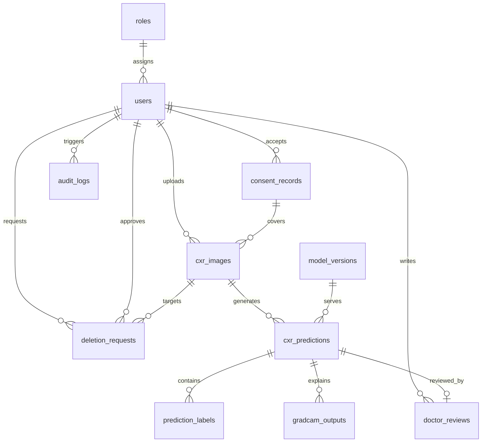

# MedVision-CXR PostgreSQL 数据库设计

## 设计原则

- 面向胸部 X 光 AI 辅助分诊，不输出 diagnosis 字段。
- 统一使用 `risk_level`、`risk_probability`、`triage_result`、`doctor_review_required`、`uncertainty_flag`、`model_version_id`、`disclaimer`。
- 默认最小化敏感信息采集，不保存真实姓名、身份证号、手机号等直接标识信息。
- 所有核心表包含 `created_at` 与 `updated_at`。
- 审计日志不记录敏感个人信息原文。
- 支持软删除的表采用 `is_deleted`，删除动作本身采用 `deletion_requests` 审批与留痕。

## ER 图



## 1. roles

### SQL

```sql
CREATE TABLE roles (
    id UUID PRIMARY KEY DEFAULT gen_random_uuid(),
    role_code VARCHAR(64) NOT NULL UNIQUE,
    role_name VARCHAR(128) NOT NULL,
    permissions_json JSONB NOT NULL DEFAULT '{}'::jsonb,
    created_at TIMESTAMPTZ NOT NULL DEFAULT NOW(),
    updated_at TIMESTAMPTZ NOT NULL DEFAULT NOW()
);

CREATE INDEX ix_roles_role_code ON roles (role_code);
```

### 字段说明

| 字段 | 说明 |
|---|---|
| id | 角色主键 |
| role_code | 角色编码，如 admin、doctor、clinician |
| role_name | 角色显示名 |
| permissions_json | 角色权限集合 |
| created_at / updated_at | 审计时间戳 |

- 主键：`id`
- 外键：无
- 索引：`role_code`
- 隐私风险：低
- 是否需要加密：否
- 是否可以软删除：一般不需要，建议通过状态管理或保留历史版本

## 2. users

### SQL

```sql
CREATE TABLE users (
    id UUID PRIMARY KEY DEFAULT gen_random_uuid(),
    email VARCHAR(255) NOT NULL UNIQUE,
    password_hash VARCHAR(255) NOT NULL,
    role_id UUID NOT NULL REFERENCES roles(id),
    status VARCHAR(32) NOT NULL DEFAULT 'active',
    last_login_at TIMESTAMPTZ,
    is_deleted BOOLEAN NOT NULL DEFAULT FALSE,
    created_at TIMESTAMPTZ NOT NULL DEFAULT NOW(),
    updated_at TIMESTAMPTZ NOT NULL DEFAULT NOW()
);

CREATE INDEX ix_users_email ON users (email);
CREATE INDEX ix_users_status ON users (status);
CREATE INDEX ix_users_is_deleted ON users (is_deleted);
```

### 字段说明

| 字段 | 说明 |
|---|---|
| id | 用户主键 |
| email | 登录邮箱 |
| password_hash | 哈希后的密码 |
| role_id | 角色外键 |
| status | 用户状态 |
| last_login_at | 最后登录时间 |
| is_deleted | 软删除标记 |
| created_at / updated_at | 审计时间戳 |

- 主键：`id`
- 外键：`role_id -> roles.id`
- 索引：`email`、`status`、`is_deleted`
- 隐私风险：中
- 是否需要加密：`password_hash` 不可逆哈希，`email` 视合规策略可做列级加密
- 是否可以软删除：是

## 3. consent_records

### SQL

```sql
CREATE TABLE consent_records (
    id UUID PRIMARY KEY DEFAULT gen_random_uuid(),
    user_id UUID NOT NULL REFERENCES users(id),
    consent_version VARCHAR(64) NOT NULL,
    consent_text_snapshot TEXT NOT NULL,
    accepted_at TIMESTAMPTZ NOT NULL DEFAULT NOW(),
    created_at TIMESTAMPTZ NOT NULL DEFAULT NOW(),
    updated_at TIMESTAMPTZ NOT NULL DEFAULT NOW()
);

CREATE INDEX ix_consent_records_user_id ON consent_records (user_id);
CREATE INDEX ix_consent_records_consent_version ON consent_records (consent_version);
CREATE INDEX ix_consent_records_accepted_at ON consent_records (accepted_at);
```

### 字段说明

| 字段 | 说明 |
|---|---|
| id | 同意记录主键 |
| user_id | 关联用户 |
| consent_version | 知情同意版本 |
| consent_text_snapshot | 文案快照 |
| accepted_at | 同意时间 |
| created_at / updated_at | 审计时间戳 |

- 主键：`id`
- 外键：`user_id -> users.id`
- 索引：`user_id`、`consent_version`、`accepted_at`
- 隐私风险：中
- 是否需要加密：通常不需要，但可视合规需要对快照文本做加密归档
- 是否可以软删除：通常不建议，因其属于合规留痕

## 4. cxr_images

### SQL

```sql
CREATE TABLE cxr_images (
    id UUID PRIMARY KEY DEFAULT gen_random_uuid(),
    uploader_id UUID NOT NULL REFERENCES users(id),
    consent_id UUID NOT NULL REFERENCES consent_records(id),
    storage_key VARCHAR(255) NOT NULL UNIQUE,
    original_format VARCHAR(32) NOT NULL,
    width INTEGER,
    height INTEGER,
    modality VARCHAR(32),
    quality_flags JSONB,
    is_deleted BOOLEAN NOT NULL DEFAULT FALSE,
    created_at TIMESTAMPTZ NOT NULL DEFAULT NOW(),
    updated_at TIMESTAMPTZ NOT NULL DEFAULT NOW()
);

CREATE INDEX ix_cxr_images_uploader_id ON cxr_images (uploader_id);
CREATE INDEX ix_cxr_images_consent_id ON cxr_images (consent_id);
CREATE INDEX ix_cxr_images_storage_key ON cxr_images (storage_key);
CREATE INDEX ix_cxr_images_modality ON cxr_images (modality);
CREATE INDEX ix_cxr_images_is_deleted ON cxr_images (is_deleted);
```

### 字段说明

| 字段 | 说明 |
|---|---|
| id | 图像主键 |
| uploader_id | 上传用户 |
| consent_id | 知情同意记录 |
| storage_key | 匿名化对象存储路径 |
| original_format | 原始文件格式 |
| width / height | 图像尺寸 |
| modality | 影像模态，如 DX/CR |
| quality_flags | 图像质量检查结果 |
| is_deleted | 软删除标记 |
| created_at / updated_at | 审计时间戳 |

- 主键：`id`
- 外键：`uploader_id -> users.id`，`consent_id -> consent_records.id`
- 索引：`uploader_id`、`consent_id`、`storage_key`、`modality`、`is_deleted`
- 隐私风险：高
- 是否需要加密：是，建议对象存储端 SSE + 数据库磁盘加密；`storage_key` 本身可不加密但必须匿名化
- 是否可以软删除：是

## 5. model_versions

### SQL

```sql
CREATE TABLE model_versions (
    id UUID PRIMARY KEY DEFAULT gen_random_uuid(),
    version_name VARCHAR(128) NOT NULL UNIQUE,
    model_family VARCHAR(128) NOT NULL,
    dataset_summary JSONB NOT NULL DEFAULT '{}'::jsonb,
    metrics_json JSONB NOT NULL DEFAULT '{}'::jsonb,
    artifact_uri VARCHAR(255) NOT NULL,
    is_active BOOLEAN NOT NULL DEFAULT FALSE,
    deployed_at TIMESTAMPTZ,
    created_at TIMESTAMPTZ NOT NULL DEFAULT NOW(),
    updated_at TIMESTAMPTZ NOT NULL DEFAULT NOW()
);

CREATE INDEX ix_model_versions_version_name ON model_versions (version_name);
CREATE INDEX ix_model_versions_model_family ON model_versions (model_family);
CREATE INDEX ix_model_versions_is_active ON model_versions (is_active);
```

### 字段说明

| 字段 | 说明 |
|---|---|
| id | 模型版本主键 |
| version_name | 模型版本名 |
| model_family | 模型家族，如 DenseNet121 |
| dataset_summary | 训练数据摘要 |
| metrics_json | 评估指标摘要 |
| artifact_uri | 模型工件路径 |
| is_active | 是否线上生效 |
| deployed_at | 上线时间 |
| created_at / updated_at | 审计时间戳 |

- 主键：`id`
- 外键：无
- 索引：`version_name`、`model_family`、`is_active`
- 隐私风险：低
- 是否需要加密：一般不需要
- 是否可以软删除：一般不建议删除，建议停用并保留版本历史

## 6. cxr_predictions

### SQL

```sql
CREATE TABLE cxr_predictions (
    id UUID PRIMARY KEY DEFAULT gen_random_uuid(),
    image_id UUID NOT NULL REFERENCES cxr_images(id),
    model_version_id UUID NOT NULL REFERENCES model_versions(id),
    job_status VARCHAR(32) NOT NULL DEFAULT 'queued',
    overall_risk_level VARCHAR(16) NOT NULL,
    uncertainty_flag BOOLEAN NOT NULL DEFAULT FALSE,
    doctor_review_required BOOLEAN NOT NULL DEFAULT FALSE,
    confidence_score DOUBLE PRECISION,
    disclaimer TEXT NOT NULL,
    raw_scores_json JSONB NOT NULL DEFAULT '{}'::jsonb,
    triage_result_json JSONB NOT NULL DEFAULT '{}'::jsonb,
    created_at TIMESTAMPTZ NOT NULL DEFAULT NOW(),
    updated_at TIMESTAMPTZ NOT NULL DEFAULT NOW()
);

CREATE INDEX ix_cxr_predictions_image_id ON cxr_predictions (image_id);
CREATE INDEX ix_cxr_predictions_model_version_id ON cxr_predictions (model_version_id);
CREATE INDEX ix_cxr_predictions_job_status ON cxr_predictions (job_status);
CREATE INDEX ix_cxr_predictions_overall_risk_level ON cxr_predictions (overall_risk_level);
CREATE INDEX ix_cxr_predictions_uncertainty_flag ON cxr_predictions (uncertainty_flag);
CREATE INDEX ix_cxr_predictions_doctor_review_required ON cxr_predictions (doctor_review_required);
```

### 字段说明

| 字段 | 说明 |
|---|---|
| id | 预测主键 |
| image_id | 对应胸片 |
| model_version_id | 使用的模型版本 |
| job_status | 推理任务状态 |
| overall_risk_level | 总体风险等级 |
| uncertainty_flag | 不确定性标记 |
| doctor_review_required | 是否需要医生复核 |
| confidence_score | 模型置信度 |
| disclaimer | 医疗免责声明 |
| raw_scores_json | 原始多标签概率 |
| triage_result_json | 分诊结果摘要 |
| created_at / updated_at | 审计时间戳 |

- 主键：`id`
- 外键：`image_id -> cxr_images.id`，`model_version_id -> model_versions.id`
- 索引：`image_id`、`model_version_id`、`job_status`、`overall_risk_level`、`uncertainty_flag`、`doctor_review_required`
- 隐私风险：高
- 是否需要加密：建议对 `raw_scores_json` 与 `triage_result_json` 启用磁盘或列级加密，避免结果与图像关联后的敏感风险
- 是否可以软删除：一般由图像删除流程联动，不单独建议软删除

## 7. prediction_labels

### SQL

```sql
CREATE TABLE prediction_labels (
    id UUID PRIMARY KEY DEFAULT gen_random_uuid(),
    prediction_id UUID NOT NULL REFERENCES cxr_predictions(id),
    label_code VARCHAR(64) NOT NULL,
    risk_probability DOUBLE PRECISION NOT NULL,
    threshold_used DOUBLE PRECISION NOT NULL,
    risk_flag BOOLEAN NOT NULL,
    calibrated_score DOUBLE PRECISION,
    finding_text TEXT,
    created_at TIMESTAMPTZ NOT NULL DEFAULT NOW(),
    updated_at TIMESTAMPTZ NOT NULL DEFAULT NOW(),
    CONSTRAINT uq_prediction_label_code UNIQUE (prediction_id, label_code)
);

CREATE INDEX ix_prediction_labels_prediction_id ON prediction_labels (prediction_id);
CREATE INDEX ix_prediction_labels_risk_flag ON prediction_labels (risk_flag);
```

### 字段说明

| 字段 | 说明 |
|---|---|
| id | 标签记录主键 |
| prediction_id | 关联预测 |
| label_code | 标签编码 |
| risk_probability | 风险概率 |
| threshold_used | 判定阈值 |
| risk_flag | 是否触发风险提示 |
| calibrated_score | 校准后分数 |
| finding_text | 医疗安全文案 |
| created_at / updated_at | 审计时间戳 |

- 主键：`id`
- 外键：`prediction_id -> cxr_predictions.id`
- 索引：`prediction_id`、`risk_flag`，联合唯一键 `(prediction_id, label_code)`
- 隐私风险：中到高
- 是否需要加密：可选，通常依赖上层磁盘/备份加密即可
- 是否可以软删除：一般由预测记录级联管理

## 8. gradcam_outputs

### SQL

```sql
CREATE TABLE gradcam_outputs (
    id UUID PRIMARY KEY DEFAULT gen_random_uuid(),
    prediction_id UUID NOT NULL REFERENCES cxr_predictions(id),
    label_code VARCHAR(64) NOT NULL,
    heatmap_storage_key VARCHAR(255) NOT NULL UNIQUE,
    overlay_storage_key VARCHAR(255) NOT NULL UNIQUE,
    target_layer VARCHAR(128) NOT NULL,
    created_at TIMESTAMPTZ NOT NULL DEFAULT NOW(),
    updated_at TIMESTAMPTZ NOT NULL DEFAULT NOW(),
    CONSTRAINT uq_gradcam_prediction_label UNIQUE (prediction_id, label_code)
);

CREATE INDEX ix_gradcam_outputs_prediction_id ON gradcam_outputs (prediction_id);
CREATE INDEX ix_gradcam_outputs_heatmap_storage_key ON gradcam_outputs (heatmap_storage_key);
CREATE INDEX ix_gradcam_outputs_overlay_storage_key ON gradcam_outputs (overlay_storage_key);
```

### 字段说明

| 字段 | 说明 |
|---|---|
| id | Grad-CAM 输出主键 |
| prediction_id | 关联预测 |
| label_code | 对应解释标签 |
| heatmap_storage_key | 热力图路径 |
| overlay_storage_key | 叠加图路径 |
| target_layer | 目标卷积层 |
| created_at / updated_at | 审计时间戳 |

- 主键：`id`
- 外键：`prediction_id -> cxr_predictions.id`
- 索引：`prediction_id`、`heatmap_storage_key`、`overlay_storage_key`，联合唯一键 `(prediction_id, label_code)`
- 隐私风险：高，因其可与原始影像关联
- 是否需要加密：建议对象存储和备份加密
- 是否可以软删除：通常由图像/预测删除链路联动

## 9. doctor_reviews

### SQL

```sql
CREATE TABLE doctor_reviews (
    id UUID PRIMARY KEY DEFAULT gen_random_uuid(),
    prediction_id UUID NOT NULL REFERENCES cxr_predictions(id),
    reviewer_id UUID NOT NULL REFERENCES users(id),
    review_status VARCHAR(32) NOT NULL,
    review_priority VARCHAR(16) NOT NULL,
    review_action VARCHAR(32) NOT NULL,
    review_note TEXT,
    reviewed_at TIMESTAMPTZ,
    created_at TIMESTAMPTZ NOT NULL DEFAULT NOW(),
    updated_at TIMESTAMPTZ NOT NULL DEFAULT NOW(),
    CONSTRAINT uq_doctor_reviews_prediction_id UNIQUE (prediction_id)
);

CREATE INDEX ix_doctor_reviews_prediction_id ON doctor_reviews (prediction_id);
CREATE INDEX ix_doctor_reviews_reviewer_id ON doctor_reviews (reviewer_id);
CREATE INDEX ix_doctor_reviews_review_status ON doctor_reviews (review_status);
CREATE INDEX ix_doctor_reviews_review_priority ON doctor_reviews (review_priority);
CREATE INDEX ix_doctor_reviews_reviewed_at ON doctor_reviews (reviewed_at);
```

### 字段说明

| 字段 | 说明 |
|---|---|
| id | 医生复核主键 |
| prediction_id | 关联预测 |
| reviewer_id | 复核医生 |
| review_status | 复核状态 |
| review_priority | 复核优先级 |
| review_action | 同意/调整/进一步检查/不确定 |
| review_note | 人工备注 |
| reviewed_at | 复核时间 |
| created_at / updated_at | 审计时间戳 |

- 主键：`id`
- 外键：`prediction_id -> cxr_predictions.id`，`reviewer_id -> users.id`
- 索引：`prediction_id`、`reviewer_id`、`review_status`、`review_priority`、`reviewed_at`
- 隐私风险：高
- 是否需要加密：建议对 `review_note` 视合规要求做列级加密或透明加密
- 是否可以软删除：不建议，复核记录应可审计

## 10. audit_logs

### SQL

```sql
CREATE TABLE audit_logs (
    id UUID PRIMARY KEY DEFAULT gen_random_uuid(),
    actor_user_id UUID REFERENCES users(id),
    action_type VARCHAR(64) NOT NULL,
    resource_type VARCHAR(64) NOT NULL,
    resource_id UUID,
    request_id VARCHAR(128),
    ip_hash VARCHAR(128),
    user_agent TEXT,
    event_payload JSONB,
    created_at TIMESTAMPTZ NOT NULL DEFAULT NOW(),
    updated_at TIMESTAMPTZ NOT NULL DEFAULT NOW()
);

CREATE INDEX ix_audit_logs_actor_user_id ON audit_logs (actor_user_id);
CREATE INDEX ix_audit_logs_action_type ON audit_logs (action_type);
CREATE INDEX ix_audit_logs_resource_type ON audit_logs (resource_type);
CREATE INDEX ix_audit_logs_resource_id ON audit_logs (resource_id);
CREATE INDEX ix_audit_logs_request_id ON audit_logs (request_id);
```

### 字段说明

| 字段 | 说明 |
|---|---|
| id | 审计日志主键 |
| actor_user_id | 操作人 |
| action_type | 动作类型 |
| resource_type | 资源类型 |
| resource_id | 资源 ID |
| request_id | 请求链路 ID |
| ip_hash | 哈希化 IP |
| user_agent | 终端信息 |
| event_payload | 审计载荷 |
| created_at / updated_at | 审计时间戳 |

- 主键：`id`
- 外键：`actor_user_id -> users.id`
- 索引：`actor_user_id`、`action_type`、`resource_type`、`resource_id`、`request_id`
- 隐私风险：中
- 是否需要加密：推荐对 `event_payload` 启用磁盘或列级加密；`ip_hash` 已做哈希化
- 是否可以软删除：不建议，审计记录应防篡改保留

## 11. deletion_requests

### SQL

```sql
CREATE TABLE deletion_requests (
    id UUID PRIMARY KEY DEFAULT gen_random_uuid(),
    image_id UUID NOT NULL REFERENCES cxr_images(id),
    requested_by UUID NOT NULL REFERENCES users(id),
    delete_mode VARCHAR(16) NOT NULL,
    request_status VARCHAR(32) NOT NULL,
    approved_by UUID REFERENCES users(id),
    completed_at TIMESTAMPTZ,
    created_at TIMESTAMPTZ NOT NULL DEFAULT NOW(),
    updated_at TIMESTAMPTZ NOT NULL DEFAULT NOW()
);

CREATE INDEX ix_deletion_requests_image_id ON deletion_requests (image_id);
CREATE INDEX ix_deletion_requests_requested_by ON deletion_requests (requested_by);
CREATE INDEX ix_deletion_requests_delete_mode ON deletion_requests (delete_mode);
CREATE INDEX ix_deletion_requests_request_status ON deletion_requests (request_status);
CREATE INDEX ix_deletion_requests_approved_by ON deletion_requests (approved_by);
```

### 字段说明

| 字段 | 说明 |
|---|---|
| id | 删除请求主键 |
| image_id | 关联胸片 |
| requested_by | 请求发起人 |
| delete_mode | soft / hard |
| request_status | pending / approved / completed / rejected |
| approved_by | 审批人 |
| completed_at | 完成时间 |
| created_at / updated_at | 审计时间戳 |

- 主键：`id`
- 外键：`image_id -> cxr_images.id`，`requested_by -> users.id`，`approved_by -> users.id`
- 索引：`image_id`、`requested_by`、`delete_mode`、`request_status`、`approved_by`
- 隐私风险：中
- 是否需要加密：一般不需要，除非审批说明里引入敏感文本
- 是否可以软删除：不建议，因其属于删除审计链的一部分

## SQLAlchemy ORM 模型

当前仓库中的 ORM 实现位于：

- [medvision-cxr/backend/app/models/models.py](medvision-cxr/backend/app/models/models.py)

该文件已包含以下实体：

- `Role`
- `User`
- `ConsentRecord`
- `CXRImage`
- `ModelVersion`
- `CXRPrediction`
- `PredictionLabel`
- `GradCAMOutput`
- `DoctorReview`
- `AuditLog`
- `DeletionRequest`

## Alembic Migration 示例

当前仓库中的可执行 Alembic 迁移链位于：

- [medvision-cxr/backend/alembic/versions/20260430_0001_identity_and_consent.py](medvision-cxr/backend/alembic/versions/20260430_0001_identity_and_consent.py)
- [medvision-cxr/backend/alembic/versions/20260430_0002_images_and_models.py](medvision-cxr/backend/alembic/versions/20260430_0002_images_and_models.py)
- [medvision-cxr/backend/alembic/versions/20260430_0003_predictions_reviews_and_audit.py](medvision-cxr/backend/alembic/versions/20260430_0003_predictions_reviews_and_audit.py)
- [medvision-cxr/backend/alembic/versions/20260430_0004_deletion_requests.py](medvision-cxr/backend/alembic/versions/20260430_0004_deletion_requests.py)

配套配置文件位于：

- [medvision-cxr/backend/alembic.ini](medvision-cxr/backend/alembic.ini)
- [medvision-cxr/backend/alembic/env.py](medvision-cxr/backend/alembic/env.py)

它们现在组成了一条真实可执行的迁移链，而不是单个示例文件。

## 软删除建议总表

| 表名 | 是否建议软删除 | 说明 |
|---|---|---|
| users | 是 | 用户停用与保留审计需要 |
| roles | 否 | 建议保留角色历史或用状态字段管理 |
| consent_records | 否 | 合规留痕不建议删除 |
| cxr_images | 是 | 原始数据删除应走删除请求流程 |
| model_versions | 否 | 建议停用而不是删除 |
| cxr_predictions | 一般不单独软删除 | 通常与图像删除链路绑定 |
| prediction_labels | 否 | 由预测级联管理 |
| gradcam_outputs | 否 | 由预测或图像级联管理 |
| doctor_reviews | 否 | 需要审计保留 |
| audit_logs | 否 | 需要防篡改保留 |
| deletion_requests | 否 | 删除链路本身需保留 |

## 加密建议总表

| 表名 | 建议 |
|---|---|
| users | 密码做哈希；邮箱可视合规做列级加密 |
| cxr_images | 对象存储端加密，数据库磁盘加密 |
| cxr_predictions | 建议磁盘加密，必要时对结果 JSON 做列级加密 |
| prediction_labels | 通常依赖磁盘加密即可 |
| gradcam_outputs | 对象存储与备份加密 |
| doctor_reviews | `review_note` 可按合规要求加密 |
| audit_logs | `event_payload` 建议加密或严格最小化 |
| 其他表 | 通常依赖数据库磁盘/备份加密 |